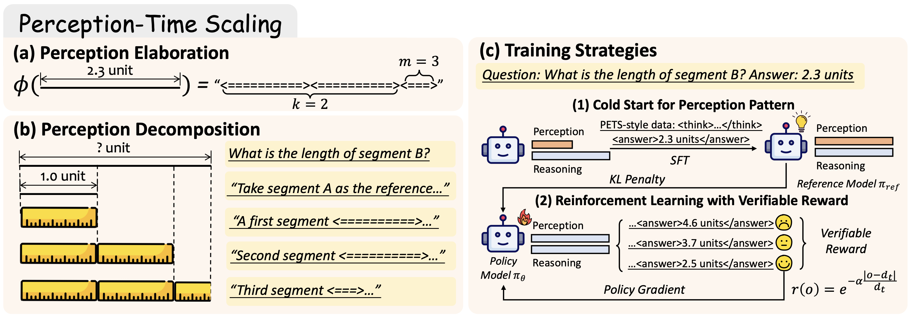

# Perception-Time Scaling (PTS)

<div align="center">
  <a href="https://arxiv.org/abs/2510.08964"></a>
  <a href="https://huggingface.co/datasets/Monosail/DisTANCE"></a>
</div>

---

## Motivation

Recent advances in inference-time scaling — particularly reinforcement learning with verifiable rewards — have substantially improved the *reasoning* capabilities of Large Vision-Language Models (LVLMs). However, when applying similar strategies to **visual perception** tasks (e.g., estimating lengths, areas, and perimeters from images), we find that:

- LVLMs exhibit **limited estimation precision** on our perception benchmark DisTANCE.
- Simply scaling inference-time compute offers only **marginal gains**.

We attribute this failure to the **fast perception paradigm**: current LVLMs treat visual understanding as a one-shot output without modeling the underlying perceptual process. As a result, perception cannot benefit from additional thinking tokens the way reasoning tasks do.

To address this, we propose **Perception-Time Scaling (PTS)**, a novel paradigm that:
1. **Perception Elaboration** — represents spatial quantities as token-rich symbolic sequences (e.g., `<==========><==>`) so that the model can "see" magnitudes through tokens.
2. **Perception Decomposition** — breaks a complex perception question into a chain of intermediate, tractable sub-problems (estimating each component length first, then computing the target).

Combined with reinforcement learning, PTS raises high-precision performance on DisTANCE from **8.0% → 64.7%** and generalizes well to out-of-domain tasks. Surprisingly, even purely synthetic PTS data, when mixed with math reasoning data, yields consistent gains on both reasoning and real-world perception benchmarks.

## Method

<div align="center">
  
</div>

**(a) Perception Elaboration**: A length of `k` units is symbolized as `k` groups of `=` signs enclosed in `<>`, providing an explicit token-level representation of magnitude.

**(b) Perception Decomposition**: Instead of answering directly, the model first selects a reference segment, visually estimates each sub-segment's relative length via elaboration tokens, and accumulates them to derive the final answer.

**(c) Training Strategies**: Training proceeds in two stages — (1) **Cold-Start SFT** with PTS-style synthetic data to bootstrap the perception pattern, followed by (2) **Reinforcement Learning with Verifiable Reward** using a continuous reward $r(o) = e^{-\alpha \frac{|o - d_t|}{d_t}}$ to refine estimation precision.

---

## Repository Structure

```
PTS/
├── asset/
│   └── PTS.png                        # Method figure
├── dataset/
│   ├── collection/                    # Data construction code
│   │   ├── synthesize/                # Step 1: Synthesize images & metadata
│   │   │   ├── annotate_1d_length.py
│   │   │   ├── annotate_1d_perimeter.py
│   │   │   ├── annotate_2d_area_accurate.py
│   │   │   ├── annotate_2d_area_bbox.py
│   │   │   ├── grpo_1d_length.py
│   │   │   ├── grpo_1d_perimeter.py
│   │   │   └── grpo_2d_area.py
│   │   ├── annotate/                  # Step 2: LLM annotation
│   │   │   ├── collect_PTS.py         # Call LLM with PTS prompt
│   │   │   ├── collect_CoT.py         # Call LLM with CoT prompt (baseline)
│   │   │   ├── collect_direct.py      # Direct-answer format (baseline)
│   │   │   ├── filter_PTS.py          # Filter & post-process LLM outputs
│   │   │   ├── prompts/               # Few-shot prompt templates
│   │   │   └── collect_*.sh           # End-to-end collection scripts
│   │   └── merge.py                   # Merge GRPO datasets
│   └── data/                          # Collected datasets (ready to use)
│       ├── grpo/
│       │   ├── curriculum_6k.jsonl    # 6k RL training samples
│       │   └── images/
│       └── sft/
│           ├── pts.json               # 6k PTS cold-start SFT samples
│           ├── cot.json               # 6k CoT SFT samples (baseline)
│           └── images/
└── DisTANCE/                          # Perception benchmark
    └── benchmark.parquet
```

---

## Dataset

### SFT Data (`dataset/data/sft/`)

| File | Size | Description |
|---|---|---|
| `pts.json` | 6,000 | PTS-style cold-start data for SFT. Each sample contains a visual estimation question, a PTS chain-of-thought response with elaboration tokens, and an image path. Used for Stage 1 cold-start SFT. |
| `cot.json` | 6,000 | Chain-of-Thought baseline data for SFT. Same questions with standard CoT responses. |

Covers three task types: **1D length**, **1D perimeter**, and **2D area** estimation across synthetic geometric images.

### GRPO Data (`dataset/data/grpo/`)

| File | Size | Description |
|---|---|---|
| `curriculum_6k.jsonl` | 6,000 | Curriculum RL training data across 1D length, 1D perimeter, and 2D area tasks. Each sample has `id`, `images`, `problem`, and `answer` fields. |

Image paths in all data files are relative to the respective data directory (e.g., `images/1d_length/train_1d_length_000001.png`).

---

## Data Construction

To reproduce the dataset from scratch:

**Step 1 — Synthesize images and metadata:**
```bash
python dataset/collection/synthesize/annotate_1d_length.py --num_images 2000
python dataset/collection/synthesize/annotate_1d_perimeter.py --num_images 2000
python dataset/collection/synthesize/annotate_2d_area.py --num_images 2000
```

**Step 2 — Generate PTS annotations via LLM** (requires `OPENAI_API_KEY`):
```bash
cd dataset/collection/annotate
bash collect_1d_length_PTS.sh
bash collect_1d_perimeter_PTS.sh
bash collect_2d_area_accurate_PTS.sh
```

**Step 3 — Synthesize GRPO training data:**
```bash
python dataset/collection/synthesize/grpo_1d_length.py
python dataset/collection/synthesize/grpo_1d_perimeter.py
python dataset/collection/synthesize/grpo_2d_area.py
python dataset/collection/merge.py
```

---

## Training

We use [LLaMA-Factory](https://github.com/hiyouga/LLaMA-Factory) for supervised fine-tuning on `dataset/data/sft/pts.json`. And we use [EasyR1](https://github.com/hiyouga/EasyR1) for RL training with verifiable rewards on `dataset/data/grpo/curriculum_6k.jsonl`.

---

## Citation

```bibtex
@article{li2025unleashing,
  title={Unleashing Perception-Time Scaling to Multimodal Reasoning Models},
  author={Li, Yifan and Chen, Zhenghao and Wu, Ziheng and Zhou, Kun and Luo, Ruipu and Zhang, Can and He, Zhentao and Zhan, Yufei and Zhao, Wayne Xin and Qiu, Minghui},
  journal={arXiv preprint arXiv:2510.08964},
  year={2025}
}
```
